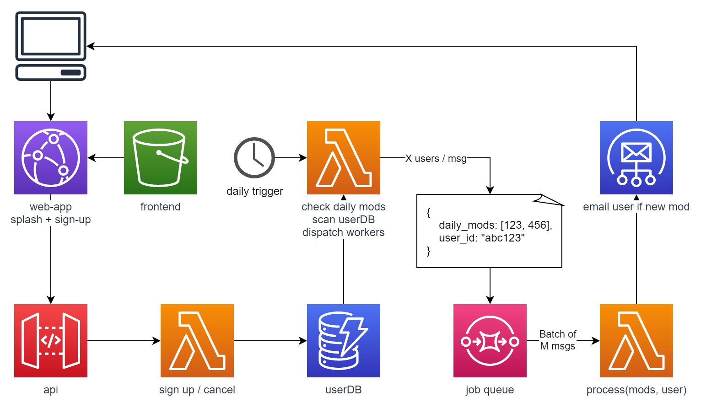

# BansheeMissingMods

Lightweight application to monitor daily banshee mods in Destiny2 and notify users if they are missing one of the mods being sold

This application performs a simple API request to the backend of `@cujarrett`'s [daily banshee mods twitter bot](https://github.com/cujarrett/banshee-44-mods-bot), then checks a user's Player Profile to determine if the player has acquired the daily mods or not.

Application is very much sandbox stage at this point but is running daily on a raspberry pi for myself and a friend.

## Architecture Plan

Rough plan of architecture for moving app into AWS for public exposure.

